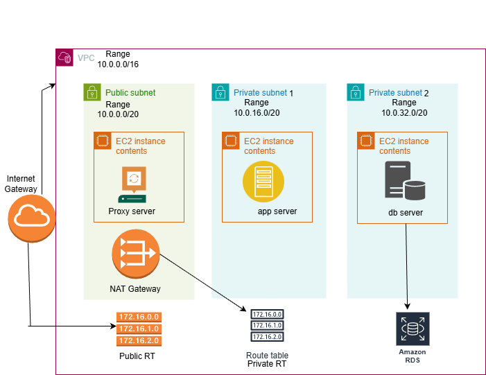
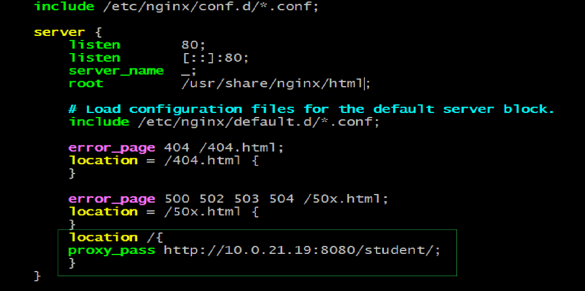
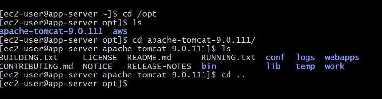
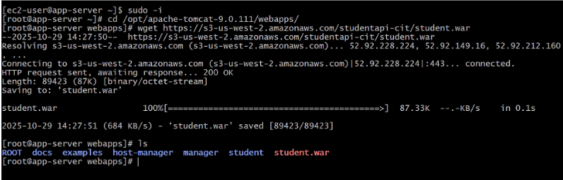
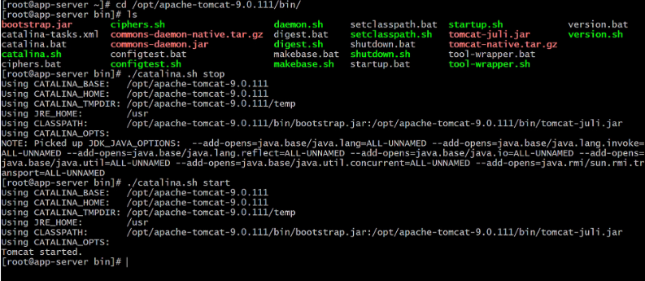

# Deployment of a Three-Tier Student Registration Application on AWS

## Indroduction

This project demonstrates the deployment of a Java-based Student Registration Web Application on Amazon Web Services (AWS) using a Three-Tier Architecture. The environment consists of an NGINX proxy server placed in a public subnet, an Apache Tomcat application server running in a private subnet, and a MariaDB database hosted on Amazon RDS.

The proxy server manages incoming HTTP requests and also functions as a bastion host, enabling secure SSH access to instances within the private subnet. The complete infrastructure is created within a custom VPC, incorporating subnets, route tables, a NAT gateway, and security groups to ensure secure and controlled communication between all tiers.

This architecture illustrates a real-world, scalable cloud deployment where user traffic flows from the proxy layer to the application layer and finally to the database layer.

## Three-Tier Architecture Diagram

## Architecture Layes

1. Presentation Tier (Proxy Layer)
Hosted in a public subnet
Uses NGINX as a reverse proxy
Handles all incoming HTTP traffic
Also works as a Jump Server (Bastion Host) to connect securely to private instances

2. Application Tier (Private Subnet)
Runs Apache Tomcat
Hosts the Java-based Student Registration Web Application
Connects to the database through JDBC

3. Database Tier (Private Subnet)
Uses Amazon RDS (MariaDB)
Stores student registration data
Only accessible from the Application Tier (port 3306)

### Steps for Deploying the Student Application Form

#### 1. Create VPC

* Name: Three-Tier-Project
* CIDR: 10.0.0.0/16

#### 2. Create subnets (across multiple Availability Zones to ensure high availability)

1. public-subnet

       CIDR: 10.0.0.0/20
       AZ: us-east-1a
       Enable auto-assign public IPv4 if you want EC2 with public IP.

2. private-subnet-1

       CIDR: 10.0.16.0/20
       AZ: us-east-1b

3. private-subnet-2

       CIDR: 10.0.32.0/20
       AZ: us-east-1c

Enable auto assign IP for Public Subnet

#### 3. Create an Internet Gateway + Public Route Table

Create an internet gateway (Three-Tier-IGW) and attach it to VPC (Three-Tier-Project)

Edit Route Table for public traffic

Rename route table to Public-RT

Edit routes: add 0.0.0.0/0 → Target Three-Tier-IGW

Attach the public route table to the public subnet (Optional)

#### 4. NAT Gateway + Private Route Table

1. Create a private route table (Private-RT). 
Associate private-RT with private-subnet-1 and private-subnet-2

2. Create NAT Gateway

* Name: Three-Tier-NAT
* Subnet: Public-subnet
* Allocate an Elastic IP for it

Edit private-RT routes
* Add 0.0.0.0/0 → target three-tier-NAT.

#### 5. Security Group (Three-Tier-SG)

Create a Security Group with inbound rules in EC2

* 22 (SSH)
* 80 (HTTP)
* 8080 (Tomcat)
* 3306 (MySQL/RDS)

#### 6. Launch EC2 Instances

1. Proxy Server (public)

               Name: Proxy 
               AMI: Amazon Linux 
               VPC: Three-Tier-Project
               Subnet: Public-subnet
               SG: Three-Tier-SG

2. App Server (private)

               Name: App 
               AMI: Amazon Linux 
               VPC: Three-Tier-Project
               Subnet: Private-subnet-1
               SG: Three-Tier-SG

3. DB Server (private)

               Name: DB 
               AMI: Amazon Linux 
               VPC: three-tier-Project
               Subnet: private-subnet-2
               SG: Three-Tier-SG 

#### 7.  RDS MariaDB (Managed DB)

        Type: full configuration
        Engine: MariaDB
        DB Identifier: ThreeTierRds
        Authentication: Auto-generate password(store securely)
        VPC: Three-Tier-Project
        Security Group: Three-Tier-SG
        Availability Zone: us-east-1c (or use Multi-AZ for higher availability)

Make a note of the RDS endpoint and stored password for use in the application DB settings.

#### 8. Proxy Server Setup (NGINX)

Step 1 :Connect via SSH to the Proxy instance.

Step 2: Install and start NGINX

      sudo yum update -y
      sudo yum install nginx -y
      sudo systemctl start nginx
      sudo systemctl enable nginx
      sudo systemctl status nginx
      cd /etc/nginx

Step 3: Edit NGINX configuration

   
    sudo vim nginx.conf
    Inside the server block, add: location / { proxy_pass http://:8080/student/; }

Step 4: Restart Nginx

     sudo systemctl restart nginx

#### 9. Copy the private key to the proxy server if SSH access to the application server will be done through the proxy

    scp -i <key.pem> <key.pem> ec2-user@<proxy-public-ip>:/home/ec2-user/

#### 10. Access the Application Server via SSH, either through the proxy or using AWS SSM

    sudo ssh -i <key.pem> ec2-user@<app-server-private-ip>
    sudo hostnamectl hostname app-server
    exit

  

ssh again to app server

#### 11. Install Java and Tomcat on App Server

1. Install Java and Tomcat

  update system

  install java

  install tomcat

       sudo yum update -y 
       sudo yum install java -y 
       wget https://dlcdn.apache.org/tomcat/tomcat-9/v9.0.98/bin/apache-tomcat-9.0.98.tar.gz 
       sudo tar -xvzf apache-tomcat-9.0.98.tar.gz -C /opt 

Check that tomcat is installed correctly

#### 12. Deploy Student Application

* On the app server
    
       cd /opt/<apache-tomcat-folder>/webapps/

* download the WAR provided by your source (e.g., from a PDF link or artifact storage)

       wget <link-to-studentapp.war>

### 13 Restart Tomcat

          cd /opt/apache-tomcat/bin 
          ./catalina.sh stop 
          ./catalina.sh start

          

 #### 14 Open your browser to check java page

 Paste the public ip of proxy-server on the Google

 

      

 #### 15. Database Setup (MariaDB / RDS)

 1. SSH into DB instance and take access of RDS

         sudo yum install mariadb105-server -y 
         mysql -h <RDS-ENDPOINT> -u admin -p 

 

  

 

 

 2. Create Database and table

        CREATE DATABASE studentapp;

        USE studentapp;

        CREATE TABLE IF NOT EXISTS students (
         student_id INT NOT NULL AUTO_INCREMENT,
         student_name VARCHAR(100) NOT NULL,
         student_addr VARCHAR(100) NOT NULL,
         student_age VARCHAR(3) NOT NULL,
         student_qual VARCHAR(20) NOT NULL,
         student_percent VARCHAR(10) NOT NULL,
         student_year_passed VARCHAR(10) NOT NULL,
         PRIMARY KEY (student_id)
        );

        SHOW TABLES;
        SELECT * FROM students;
        exit

 

#### 16. Connect App Server to RDS

1. Install JDBC connector in App server

        sudo -i 
        cd /opt/apache-tomcat-folder/lib 
        wget <S3-Bucket-URL-to-JDBC-Connector> 
        ls

  

2. Edit Tomcat context.xml to add resource

        <Resource name="jdbc/TestDB" auth="Container" 
          type="javax.sql.DataSource" 
          maxTotal="500" maxIdle="30" maxWaitMillis="1000" 
          username="admin" password="redhat123!" 
          driverClassName="com.mysql.jdbc.Driver" 
          url="jdbc:mysql://<RDS-ENDPOINT>:3306/studentapp?useUnicode=yes&characterEncoding=utf8"/>

 

3. Restart Tomcat

         cd /opt/<apache-tomcat-folder>/bin/
         ./catalina.sh stop
         ./catalina.sh start

          

#### 17. Verify Output

1. Copy and Paste the Proxy Public IP in a browser: http://<proxy-public-ip>/

* Fill the Student Registration Form

  

 

 

2.  Verify entries in the RDS

            USE studentapp;
            SELECT * FROM students;

3. You will be able to view the inserted entries            

 

### Troubleshooting 

If the application is not accessible, verify the following:

* Security Groups: Ensure the inbound rules allow the required ports.

* Network ACLs: Confirm the subnets permit the necessary traffic.

* Route Tables: Check that the public subnet routes to the Internet Gateway (IGW) and the private subnet routes through the NAT gateway.

* Tomcat Server: Verify that Tomcat is running and review the catalina.out logs for errors.

* NGINX Logs: Inspect /var/log/nginx/error.log for any issues.

* RDS Access: Make sure the database’s inbound rules allow connections from the application’s security group on port 3306.

### Final Thoughts

This project demonstrates the successful deployment of a Three-Tier Web Application on AWS, featuring:

* Secure network architecture using a VPC, subnets, and routing

* Scalable computing resources with EC2 instances

* Managed database services via Amazon RDS

* Layered traffic flow from proxy to application server to database

It highlights essential AWS concepts, including networking, EC2 setup, and the integration of compute and database layers, reflecting a real-world cloud architecture.

